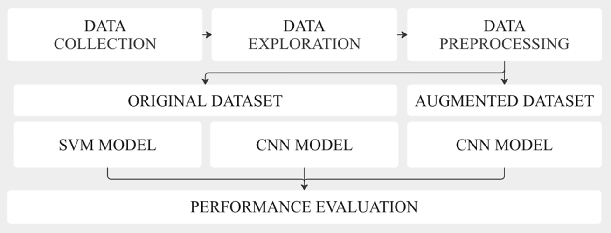

# ♻️ AI Waste Image Classification  
**A machine learning project for automated waste sorting using computer vision**

---

## 🔧 Tech Stack

`Python · Computer Vision · CNN · SVM · PCA · TensorFlow / Keras · scikit-learn · Data Augmentation`

---

## 📌 Project Overview

This project investigates the use of **machine learning and deep learning models** to automatically classify waste images into material categories.

The objective is to evaluate how different modeling approaches perform under **real-world constraints**, such as:
- limited data availability  
- class imbalance  
- variability in visual features  

The central research question is:

> *Can an image-based machine learning system reduce waste misclassification across different contexts?*

---

## 🌍 Context and Motivation

Waste misclassification leads to inefficiencies across the recycling value chain, increasing costs and reducing sustainability outcomes.

Image-based classification systems can support:
- smart disposal systems  
- automated industrial sorting  
- environmental policy objectives  

---

## 📊 Dataset

- **Dataset:** RealWaste (UCI Machine Learning Repository)  
- **Size:** 4,752 images  
- **Classes:** 9 waste categories  

### Dataset Overview


The dataset includes multiple material categories such as plastic, metal, paper, and organic waste, capturing real-world variability in object appearance.

### Key Challenge

A strong **class imbalance** is present, influencing model behavior and performance across categories.

---

## 🧹 Data Processing Pipeline

The dataset undergoes a structured preprocessing workflow.


The pipeline includes:
- RGB conversion  
- image resizing  
- normalization  
- stratified data splitting  
- augmentation applied to the training set  

---

## 🧠 Methodology

The project follows a comparative modeling approach combining classical machine learning and deep learning.



Two main modeling strategies are implemented:
- **SVM with PCA** as a baseline  
- **CNN architectures**, trained on both original and augmented datasets  

---

## 🧠 Models Developed

### 1️⃣ Support Vector Machine (Baseline)

Pipeline:
- flattening  
- scaling  
- PCA (90% variance)  
- RBF kernel SVM  

**Accuracy:** 0.66  

---

### 2️⃣ CNN (Original Dataset)

Architecture:
- convolutional layers  
- batch normalization  
- pooling  
- dense + dropout  

**Accuracy:** 0.61  

---

### 3️⃣ CNN (Augmented Dataset) — Best Model

Same architecture trained on balanced augmented data.

**Accuracy:** 0.70  

---

## 📈 Model Performance Evaluation


The evaluation highlights differences in performance across models and classes.

Key observations:
- CNN improves significantly with augmentation  
- SVM performs strongly under limited data  
- minority classes remain challenging  

---

## 🔍 Key Insights

- Model performance is strongly driven by **data quality and balance**  
- Deep learning requires sufficient data to outperform classical approaches  
- Data augmentation improves results but does not fully solve imbalance  

---

## ⚖️ Ethical Considerations

- Label quality directly affects real-world deployment  
- Misclassification may impact recycling systems  
- Models must be adapted to local waste policies  

---

## 🚀 Future Improvements

- increase dataset size  
- apply transfer learning (ResNet, MobileNet)  
- explore object detection approaches  
- enable deployment in real-world systems  

---

## 📁 Repository Structure

```text
.
├── notebook.ipynb
├── requirements.txt
├── README.md
├── Images/
```

## 📌 Conclusion

The project demonstrates that effective waste classification depends more on **data characteristics** than on model complexity alone.
